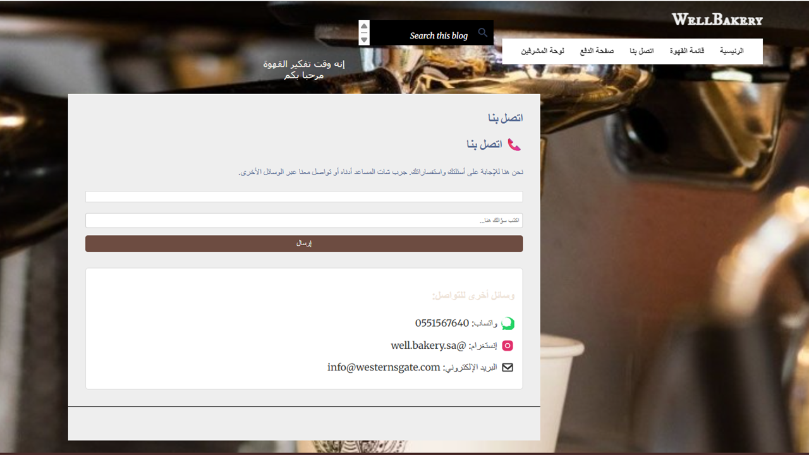

# Well Bakery Commercial Blog

This project is a fully functional, Arabic-localized blog developed for **Well Bakery**, enabling digital transformation of their café into an interactive online presence.

## 🚀 Features
- Customer chatbot to collect orders.
- Order storage integrated with Google Sheets.
- Payment facilitation page with WhatsApp, bank transfer, and PayPal options.
- Administrative dashboard with analytics and downloadable reports.
- Contact Us page with chatbot for customer inquiries.
- Fully responsive and Arabic RTL support.

## 🛠️ Technologies Used
- **HTML, CSS, JavaScript**
- **Google Apps Script**
- **Python (NLTK)**
- **Google Looker Studio**
- **Bootstrap**
- **Google Dialogflow**

## 📷 Screenshots

-----------------------

---------------------

## 📄 How to Use
1. Clone this repository.
2. Open the `index.html` file in your browser.
3. Configure Google Sheets and Apps Script for data collection.
4. Update payment details in the payment page if needed.

## 📚 References
- MDN Web Docs
- Google Apps Script Documentation
- WhatsApp Business API
- PayPal Developer Documentation

## 🤝 Contributing
Feel free to fork the project, submit issues or pull requests to improve it.

## 📜 License
This project is for educational purposes under the cooperative training program.

